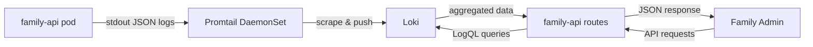

# Loki Chat Analytics Implementation

**Date**: 2025-12-03
**Status**: ✅ Implementation Complete

---

## Overview

Successfully integrated Loki-based chat analytics into the Family Admin dashboard, fixing the broken analytics page and adding comprehensive chat log analysis.

---

## Problems Fixed

### 1. Broken Analytics Page
**Issue**: Type mismatch between frontend (expecting `metrics` object) and backend (returning flat fields in `OverviewResponse`)

**Fix**: Updated `analytics.py:83-87` to return properly structured response:
```python
class OverviewResponse(BaseModel):
    metrics: Dict[str, Any]
    agent_popularity: List[Dict[str, Any]]
    recent_executions: List[Dict[str, Any]]
```

### 2. Missing Chat Log Analytics
**Issue**: Chat sessions logged to files but not visible in admin dashboard

**Solution**: Implemented Loki integration for real-time log querying

---

## Architecture



---

## Implementation Details

### Backend Changes

#### 1. Chat Logger (`chat_logger.py`)

**Modified**: Line 106-163
**Added**: `_emit_to_stdout()` method at line 244-258

**Changes**:
- Added stdout emission for Promtail collection
- Each log entry includes `"type": "chat_session_log"` for LogQL filtering
- Single-line JSON format for reliable parsing

**Example Log Entry**:
```json
{
  "type": "chat_session_log",
  "timestamp": "2025-12-03T10:15:23.456Z",
  "session_id": "sess_abc123",
  "thread_id": "thread_xyz789",
  "user_id": "john",
  "token_economics": {
    "total_tokens": 357,
    "estimated_cost_usd": 0.000714,
    "model_used": "Kimi-VL-A3B"
  },
  "performance": {
    "total_latency_ms": 5123.4
  }
}
```

#### 2. Loki Service (`loki_service.py`)

**Created**: New file with comprehensive LogQL query methods

**Key Methods**:
- `get_chat_overview(time_range)` - Comprehensive metrics overview
- `get_chat_logs(limit, time_range)` - Raw log entries
- `get_token_stats(time_range)` - Token usage by model
- `get_cost_estimate(time_range)` - Total estimated cost
- `get_latency_stats(time_range)` - P50, P95, P99 latencies
- `get_request_count(time_range)` - Total request count
- `get_error_rate(time_range)` - Error rate calculation

**LogQL Examples**:
```logql
# Token usage by model
sum by (token_economics_model_used) (
  sum_over_time(
    {app="family-api"}
    | json
    | type="chat_session_log"
    | unwrap token_economics_total_tokens [24h]
  )
)

# P95 Latency
quantile_over_time(0.95,
  {app="family-api"}
  | json
  | type="chat_session_log"
  | unwrap performance_total_latency_ms [24h]
)
```

#### 3. Analytics Routes (`analytics.py`)

**Added**: Three new endpoints (line 323-398)

**Endpoints**:
1. `GET /api/v1/analytics/chat/overview?range=24h`
   - Returns: Total requests, tokens, cost, error rate, latency metrics

2. `GET /api/v1/analytics/chat/logs?limit=50&range=24h`
   - Returns: List of recent chat log entries

3. `GET /api/v1/analytics/chat/tokens?range=7d`
   - Returns: Token usage breakdown by model

**Fixed**: `OverviewResponse` structure to match frontend expectations

---

### Frontend Changes

#### 1. Types (`analytics.ts`)

**Added**: Chat analytics types (line 26-56)

```typescript
export interface ChatLogEntry {
  timestamp: string;
  user_id: string;
  thread_id: string;
  session_id: string;
  tokens: number;
  latency_ms: number;
  cost_usd: number;
  model_used: string;
  error: boolean;
}

export interface ChatOverviewMetrics {
  total_requests: number;
  total_tokens: number;
  estimated_cost_usd: number;
  error_rate: number;
  avg_latency_ms: number;
  p95_latency_ms: number;
  time_range: string;
}

export interface TokenStats {
  by_model: Record<string, number>;
  total: number;
  time_range: string;
}
```

#### 2. API Client (`api-client.ts`)

**Added**: Chat analytics methods (line 591-614)

```typescript
async getChatAnalyticsOverview(timeRange: string = '24h'): Promise<any>
async getChatLogs(limit: number = 50, timeRange: string = '24h'): Promise<any>
async getChatTokenStats(timeRange: string = '7d'): Promise<any>
```

#### 3. Analytics Hook (`useAnalytics.ts`)

**Enhanced**: Complete rewrite with chat analytics state and methods

**New State**:
- `chatOverview: ChatOverviewMetrics | null`
- `chatLogs: ChatLogEntry[] | null`
- `tokenStats: TokenStats | null`

**New Methods**:
- `refreshChatAnalytics(timeRange)`
- `refreshChatLogs(limit, timeRange)`
- `refreshTokenStats(timeRange)`

#### 4. Analytics Dashboard (`sub-agents/page.tsx`)

**Added**: Chat Logs tab with comprehensive UI (line 174-454)

**Features**:
- Overview metrics cards (Total Requests, Tokens, Cost, Latency)
- Token usage visualization by model (horizontal bar charts)
- Recent chat sessions table with filtering by time range
- Time range selector (24h, 7d, 30d)

---

## Verification Steps

### 1. Check Promtail Configuration

Verify Promtail is scraping family-api pods:

```yaml
# infrastructure/kubernetes/monitoring/promtail/configmap.yaml
scrape_configs:
  - job_name: kubernetes-pods
    kubernetes_sd_configs:
      - role: pod
    relabel_configs:
      - source_labels: [__meta_kubernetes_namespace]
        action: keep
        regex: homelab
```

### 2. Test Log Emission

After deploying, check pod logs for JSON output:

```bash
kubectl logs -n homelab -l app=family-api --tail=10
```

Expected: Single-line JSON entries with `"type": "chat_session_log"`

### 3. Verify Logs in Loki

Port-forward Loki and query:

```bash
kubectl port-forward -n homelab svc/loki 3100:3100

curl -G 'http://localhost:3100/loki/api/v1/query_range' \
  --data-urlencode 'query={app="family-api"} | json | type="chat_session_log"' \
  --data-urlencode 'start='$(date -u -d '1 hour ago' +%s)000000000 \
  --data-urlencode 'end='$(date -u +%s)000000000
```

### 4. Test API Endpoints

```bash
# Get chat overview
curl -H "Authorization: Bearer <token>" \
  https://api.fa.pesulabs.net/api/v1/analytics/chat/overview?range=24h

# Get chat logs
curl -H "Authorization: Bearer <token>" \
  https://api.fa.pesulabs.net/api/v1/analytics/chat/logs?limit=10&range=24h

# Get token stats
curl -H "Authorization: Bearer <token>" \
  https://api.fa.pesulabs.net/api/v1/analytics/chat/tokens?range=7d
```

### 5. Verify Frontend

1. Navigate to https://admin.fa.pesulabs.net/analytics/sub-agents
2. Check "Sub-Agent Analytics" tab loads without errors
3. Click "Chat Logs" tab
4. Verify:
   - Overview metrics display (Total Requests, Tokens, Cost, Latency)
   - Token usage chart renders
   - Chat sessions table populates
   - Time range selector works

---

## Benefits

1. **No Duplicate Storage**: Logs already written; Loki queries them without DB duplication
2. **Existing Infrastructure**: Uses deployed Loki + Promtail stack
3. **Powerful LogQL**: Flexible querying for slicing and aggregating data
4. **Scalable**: Loki designed for high-volume log ingestion
5. **Automatic Retention**: Configured retention policies handle cleanup

---

## Considerations

1. **Query Performance**: LogQL queries on large time ranges may be slow
   - Mitigation: Use appropriate time ranges and limits
   - Current limits: 50-500 logs per query

2. **Data Freshness**: Small delay (seconds) between log emission and Loki availability
   - Acceptable for analytics use case

3. **Network Dependency**: Admin → Loki queries go through API backend
   - Provides authentication and access control

---

## Files Modified/Created

### Backend
- ✅ `services/family-api/src/api/services/chat_logger.py` (modified)
- ✅ `services/family-api/src/api/services/loki_service.py` (created)
- ✅ `services/family-api/src/api/routes/analytics.py` (modified)

### Frontend
- ✅ `infrastructure/admin-tools/family-admin/src/types/analytics.ts` (modified)
- ✅ `infrastructure/admin-tools/family-admin/src/lib/api-client.ts` (modified)
- ✅ `infrastructure/admin-tools/family-admin/src/hooks/useAnalytics.ts` (modified)
- ✅ `infrastructure/admin-tools/family-admin/src/app/(admin)/analytics/sub-agents/page.tsx` (modified)

---

## Next Steps

1. **Deploy Backend Changes**:
   ```bash
   cd services/family-api
   # Build and push Docker image
   # Update Kubernetes deployment
   ```

2. **Deploy Frontend Changes**:
   ```bash
   cd infrastructure/admin-tools/family-admin
   npm run build
   # Deploy via Flux or manual kubectl apply
   ```

3. **Generate Test Data**:
   - Use main chat interface to generate chat sessions
   - Wait ~1 minute for logs to appear in Loki
   - Verify Chat Logs tab updates

4. **Monitor**:
   - Watch Loki query performance
   - Check error rates in logs
   - Verify data accuracy vs file-based logs

---

## Troubleshooting

### No Logs Appearing in Loki

1. Check pod logs: `kubectl logs -n homelab <family-api-pod>`
2. Verify JSON format with `"type": "chat_session_log"`
3. Check Promtail is running: `kubectl get pods -n homelab -l app=promtail`
4. Query Loki directly (port-forward test)

### API Endpoint Errors

1. Check Loki connectivity: `http://loki.homelab.svc.cluster.local:3100`
2. Verify authentication headers
3. Check LogQL query syntax in Loki service
4. Review API pod logs for errors

### Frontend Not Loading Data

1. Verify API endpoints return data (curl test)
2. Check browser console for errors
3. Verify authentication/authorization
4. Test with different time ranges

---

## Maintenance

- **Weekly**: Review Loki query performance
- **Monthly**: Verify retention policies working correctly
- **Quarterly**: Audit LogQL queries for optimization opportunities

---

**Implementation Status**: ✅ Complete - Ready for Testing
