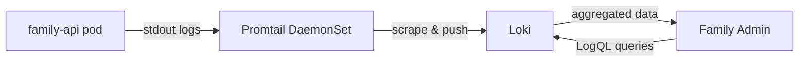

# Loki Integration for Chat Analytics

## Overview
This document describes how we use Loki (already part of our stack) to collect, store, and analyze chat session logs for the Family Admin analytics dashboard.

## Architecture



## Implementation Details

### 1. Log Emission (chat_logger.py)
The `chat_logger.py` already writes structured NDJSON logs to files. We'll modify it to **also** emit these logs to stdout so Promtail can scrape them.

**Key fields in each log entry:**
- `type`: "chat_session_log" (for filtering)
- `timestamp`: ISO 8601 timestamp
- `session_id`, `thread_id`, `user_id`
- `token_economics.total_tokens`
- `token_economics.model_used`
- `token_economics.estimated_cost_usd`
- `performance.total_latency_ms`
- `performance.http_request_ms`
- `performance.generation_ms`
- `response.error` (if error occurred)

### 2. Log Collection (Promtail)
Promtail is already deployed and scraping logs from `family-api` pods in the `homelab` namespace. No changes needed - it will automatically pick up stdout logs.

**Relevant Promtail config** (from `infrastructure/kubernetes/monitoring/promtail/configmap.yaml`):
```yaml
scrape_configs:
  - job_name: kubernetes-pods
    kubernetes_sd_configs:
      - role: pod
    relabel_configs:
      - source_labels: [__meta_kubernetes_namespace]
        action: keep
        regex: homelab
      - source_labels: [__meta_kubernetes_pod_label_app]
        target_label: app
```

### 3. Loki Service (loki_service.py)
A new Python service to query Loki's HTTP API.

**Configuration:**
- Loki URL: `http://loki.homelab.svc.cluster.local:3100`
- Library: `httpx` for async requests

**Key Methods:**

#### `query_range(query: str, start: int, end: int, step: str)`
Execute a LogQL range query.

#### `get_chat_logs(limit: int = 100, start: int = None, end: int = None)`
Fetch raw chat session logs.

**LogQL:**
```logql
{app="family-api"} 
  | json 
  | type="chat_session_log" 
  | line_format "{{.timestamp}} [{{.user_id}}] {{.thread_id}}"
```

#### `get_token_stats(time_range: str = "24h")`
Get token usage statistics by model.

**LogQL:**
```logql
sum by (model_used) (
  sum_over_time(
    {app="family-api"} 
      | json 
      | type="chat_session_log" 
      | unwrap token_economics_total_tokens [24h]
  )
)
```

#### `get_cost_estimate(time_range: str = "24h")`
Calculate total estimated cost.

**LogQL:**
```logql
sum(
  sum_over_time(
    {app="family-api"} 
      | json 
      | type="chat_session_log" 
      | unwrap token_economics_estimated_cost_usd [24h]
  )
)
```

#### `get_latency_stats(time_range: str = "24h")`
Get latency percentiles.

**LogQL:**
```logql
# P50
quantile_over_time(0.50,
  {app="family-api"} 
    | json 
    | type="chat_session_log" 
    | unwrap performance_total_latency_ms [24h]
)

# P95
quantile_over_time(0.95,
  {app="family-api"} 
    | json 
    | type="chat_session_log" 
    | unwrap performance_total_latency_ms [24h]
)

# P99
quantile_over_time(0.99,
  {app="family-api"} 
    | json 
    | type="chat_session_log" 
    | unwrap performance_total_latency_ms [24h]
)
```

#### `get_request_count(time_range: str = "24h")`
Count total chat requests.

**LogQL:**
```logql
sum(
  count_over_time(
    {app="family-api"} 
      | json 
      | type="chat_session_log" [24h]
  )
)
```

#### `get_error_rate(time_range: str = "24h")`
Calculate error rate.

**LogQL:**
```logql
# Total errors
sum(
  count_over_time(
    {app="family-api"} 
      | json 
      | type="chat_session_log" 
      | response_error="true" [24h]
  )
)

# Total requests
sum(
  count_over_time(
    {app="family-api"} 
      | json 
      | type="chat_session_log" [24h]
  )
)
```

### 4. API Endpoints (analytics.py)

#### `GET /api/v1/analytics/chat/overview`
**Response:**
```json
{
  "total_requests": 1234,
  "total_tokens": 567890,
  "estimated_cost_usd": 0.1234,
  "error_rate": 0.02,
  "avg_latency_ms": 1234.5,
  "p95_latency_ms": 2345.6,
  "time_range": "24h"
}
```

#### `GET /api/v1/analytics/chat/logs?limit=50&start=<timestamp>&end=<timestamp>`
**Response:**
```json
{
  "logs": [
    {
      "timestamp": "2025-12-03T10:15:00Z",
      "user_id": "john",
      "thread_id": "thread_abc123",
      "tokens": 234,
      "latency_ms": 1234,
      "cost_usd": 0.0005
    }
  ],
  "total": 1234,
  "limit": 50
}
```

#### `GET /api/v1/analytics/chat/tokens?range=7d`
**Response:**
```json
{
  "by_model": {
    "Kimi-VL-A3B": 123456,
    "Llama-3.1-8B": 78901
  },
  "total": 202357,
  "time_range": "7d"
}
```

## Benefits of Using Loki

1. **No Duplicate Storage**: Logs are already being written; we just query them instead of storing in PostgreSQL.
2. **Existing Infrastructure**: Loki + Promtail are already deployed and working.
3. **Powerful LogQL**: Can slice and aggregate data in many ways without custom code.
4. **Scalable**: Loki is designed for high-volume log ingestion.
5. **Retention**: Configured retention policies handle cleanup automatically.

## Considerations

1. **Query Performance**: LogQL queries on large time ranges may be slow. Use appropriate time ranges and limits.
2. **Data Freshness**: There may be a small delay (seconds) between log emission and availability in Loki.
3. **Network Dependency**: Family Admin → Loki queries go through the API backend (not direct).

## Testing

### Verify Logs Are Reaching Loki
```bash
# Port forward Loki
kubectl port-forward -n homelab svc/loki 3100:3100

# Query for chat logs (last hour)
curl -G 'http://localhost:3100/loki/api/v1/query_range' \
  --data-urlencode 'query={app="family-api"} | json | type="chat_session_log"' \
  --data-urlencode 'start='$(date -u -d '1 hour ago' +%s)000000000 \
  --data-urlencode 'end='$(date -u +%s)000000000
```

### Example Log Entry
```json
{
  "type": "chat_session_log",
  "timestamp": "2025-12-03T10:15:23.456Z",
  "session_id": "sess_abc123def456",
  "thread_id": "thread_xyz789",
  "user_id": "john",
  "user_profile": {"name": "John", "role": "parent"},
  "token_economics": {
    "prompt_tokens": 123,
    "completion_tokens": 234,
    "total_tokens": 357,
    "estimated_cost_usd": 0.000714,
    "tokens_per_second": 45.2,
    "model_used": "Kimi-VL-A3B"
  },
  "performance": {
    "total_latency_ms": 5123.4,
    "http_request_ms": 4567.8,
    "generation_ms": 4500.2,
    "prompt_assembly_ms": 123.4,
    "memory_retrieval_ms": 234.5
  },
  "response": {
    "error": false
  }
}
```
